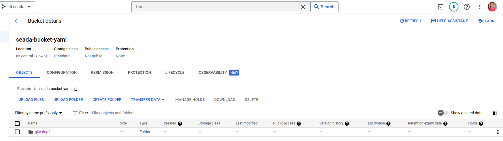
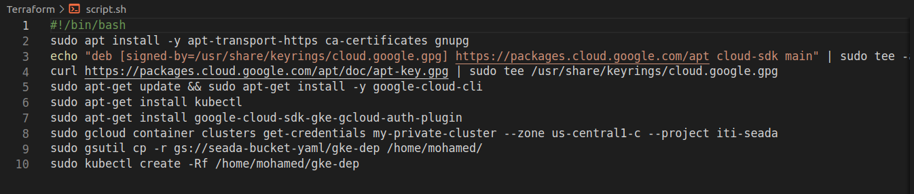
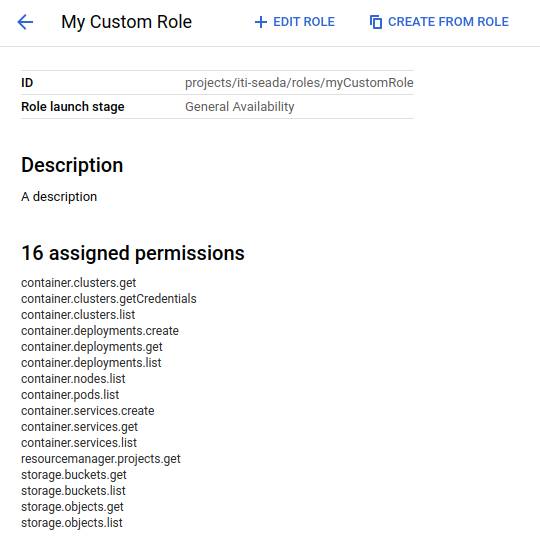
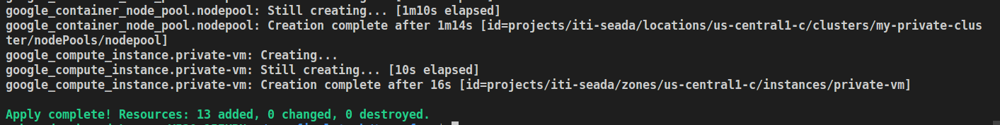
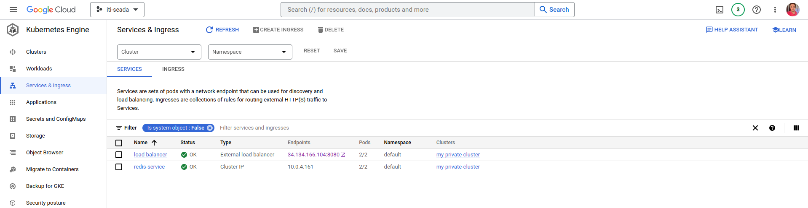
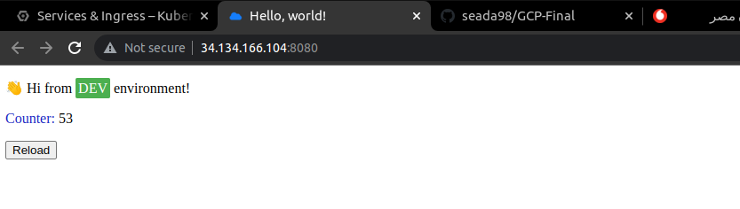

# GCP-Final

### Build Docker Image For The Pyhton App From The Dockerfile , And Upload The Image To GCR :

  * $ docker build -t gcp-python .
  * $ docker tag gcp-python eu.gcr.io/iti-seada/gcp-python
  * $ docker push eu.gcr.io/iti-seada/gcp-python

### Pull Another Redis Image From Docker Hub Then Push It To GCR :

  * $ docker pull redis
  * $ docker tag redis eu.gcr.io/iti-seada/redis-gcr
  * $ docker push eu.gcr.io/iti-seada/redis-gcr

### Create New Bucket And Upload yaml Files To The Bucket :

  * $ gsutil mb -p iti-seada -c standard -l us-central1 -b on gs://seada-bucket-yaml
  * $ gsutil cp -r /home/mohamed/GCP-Final/gke-dep/ gs://seada-bucket-yaml

### Using Script.sh File When The VM Created Will Do : 

  * Install gcloud 
  * Install kubectl
  * Install gcloud plugin
  * Connect To Kubernetes Cluster
  * Copy yaml Files From Bucket To VM
  * Apply All yaml Files

### Permission To Access Private Container Registry :

  * It Added To The Code

### For Apply The Terraform Code :

  * $ terraform init
  * $ terraform plan 
  * $ terraform apply

### Get The Load Balancer IP And Port And Test it :

